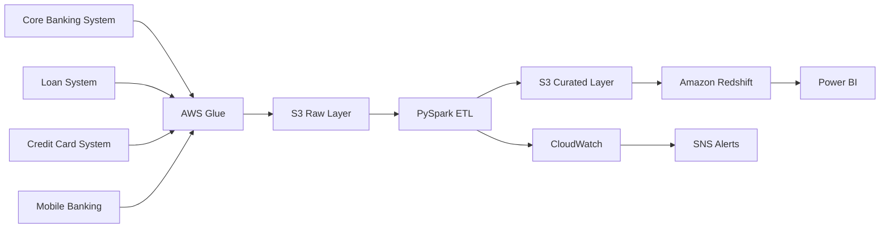
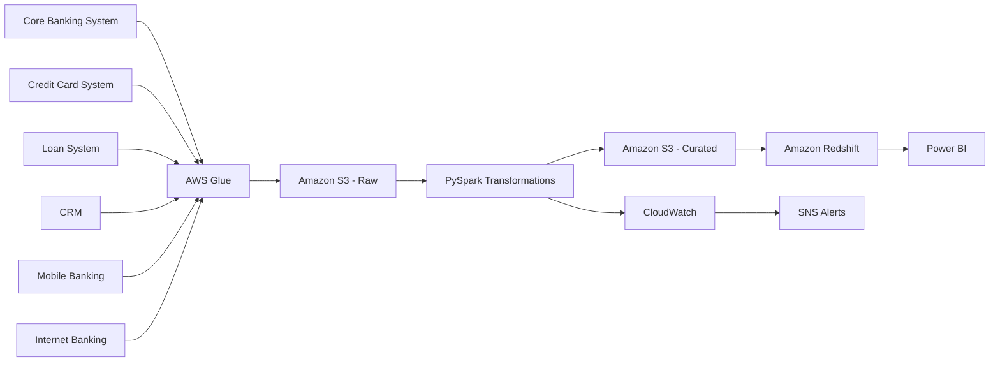

# Case Study 01: Banking Data Platform

## Overview

This case study demonstrates how to design a scalable, secure, and production-grade data platform for a banking organization. The platform ingests transactional and customer data from multiple banking systems, processes it using batch and near real-time pipelines, and serves analytics to business teams while maintaining regulatory compliance.

This design focuses on scalability, reliability, security, cost optimization, and operational excellence.

---

## Architecture Diagram

---

---

# Business Scenario

A retail bank operates across multiple channels:

- Internet Banking
- Mobile Banking
- ATM Network
- Credit Card System
- Loan Management System
- Branch Banking
- CRM
- Payment Gateway

Every day, millions of customer transactions are generated.

The bank wants to build a centralized data platform to support:

- Executive dashboards
- Customer analytics
- Fraud monitoring
- Regulatory reporting
- Risk analysis
- Marketing campaigns
- Operational reporting

---

# Business Goals

The platform should:

- Consolidate data from multiple banking systems.
- Process millions of daily transactions.
- Support batch and near real-time analytics.
- Deliver trusted datasets for BI reporting.
- Maintain high security standards.
- Scale with increasing transaction volumes.
- Minimize cloud infrastructure costs.

---

# Functional Requirements

The platform should:

- Ingest data from multiple source systems.
- Support batch and incremental processing.
- Clean and validate incoming data.
- Detect duplicate records.
- Maintain historical data.
- Load curated data into the data warehouse.
- Provide datasets for Power BI dashboards.
- Generate operational reports.

---

# Non-Functional Requirements

The platform should provide:

- High Availability
- Scalability
- Fault Tolerance
- Security
- Data Encryption
- Low Maintenance
- Monitoring
- Cost Optimization
- Disaster Recovery

---

# Assumptions

- 15 million transactions per day
- 4 million active customers
- 400 GB of new data daily
- Batch processing every hour
- Dashboard refresh every 30 minutes

---

# High-Level Architecture

---

# Why These AWS Services?

| Service | Purpose |
|----------|---------|
| AWS Glue | ETL and orchestration |
| Amazon S3 | Data Lake |
| PySpark | Data transformation |
| Amazon Redshift | Data Warehouse |
| Power BI | Dashboards |
| CloudWatch | Monitoring |
| SNS | Alerts |
| IAM | Access Control |
| KMS | Encryption |

---

# Data Flow

### Step 1

Transaction systems generate data.

↓

### Step 2

AWS Glue extracts data.

↓

### Step 3

Raw data stored in S3.

↓

### Step 4

PySpark validates data.

↓

### Step 5

Invalid records moved to Quarantine.

↓

### Step 6

Valid records transformed.

↓

### Step 7

Curated data stored in S3.

↓

### Step 8

Redshift loads curated data.

↓

### Step 9

Power BI dashboards refresh.

---

# Data Quality Checks

Every pipeline performs:

- Null validation
- Duplicate detection
- Primary key validation
- Data type validation
- Date validation
- Schema validation
- Record count validation

Invalid records are written to a quarantine table.

---

# Security

The platform implements:

- IAM Roles
- Least Privilege Access
- S3 Encryption
- Redshift Encryption
- TLS for data in transit
- AWS KMS
- Secrets Manager
- Audit Logging

---

# Monitoring

The platform monitors:

- Pipeline Success Rate
- Pipeline Failures
- SLA Compliance
- Job Duration
- Record Count
- Data Freshness
- Duplicate Percentage

Alerts are sent using Amazon SNS.

---

# Failure Handling

If a pipeline fails:

- Retry automatically.
- Log failure details.
- Send SNS notification.
- Preserve checkpoint.
- Resume from the last successful step.
- Prevent partial data loads.

---

# Cost Optimization

To reduce cloud costs:

- Store data in Parquet format.
- Compress files using Snappy.
- Partition data by date.
- Enable Glue Job Bookmarks.
- Process incremental data.
- Archive cold data using S3 Lifecycle Policies.

---

# Scalability

The platform scales by:

- Auto-scaling Glue jobs.
- Partitioning large datasets.
- Parallel Spark execution.
- Elastic Redshift compute.
- Decoupled storage and compute.

---

# Trade-offs

| Decision | Benefit | Trade-off |
|----------|----------|-----------|
| S3 Data Lake | Low-cost storage | Requires governance |
| Glue Serverless | No cluster management | Less customization than EMR |
| Redshift | Fast analytics | Higher cost than Athena for infrequent queries |
| Hourly Batch | Lower cost | Not real-time |

---

# Possible Enhancements

- Add Kafka for streaming transactions.
- Implement CDC using AWS DMS.
- Add Delta Lake or Apache Iceberg.
- Integrate dbt for transformations.
- Add Great Expectations for data quality.
- Implement Data Catalog with AWS Glue Catalog.

---

# Common Interview Questions

### Why use S3 as a Data Lake?

S3 provides durable, scalable, and cost-effective storage for structured and semi-structured data.

---

### Why Glue instead of EMR?

Glue is serverless and ideal for managed ETL workloads with less operational overhead.

---

### Why Redshift?

Redshift is optimized for analytical workloads, supports columnar storage, and provides high query performance.

---

### How would you handle duplicate transactions?

Validate primary keys, use business keys where applicable, and apply deduplication logic during the transformation stage.

---

### How do you secure customer data?

Use IAM roles, encrypt data at rest with KMS, enforce TLS for data in transit, store credentials in Secrets Manager, and follow least privilege access.

---

### How do you reduce Glue costs?

Use incremental processing with Job Bookmarks, partition data, compress files, and right-size worker types.

---

### How would you monitor the platform?

Monitor pipeline health, execution time, failures, record counts, data freshness, and SLA compliance using CloudWatch and SNS alerts.

---

# Key Takeaways

- Separate raw and curated data layers.
- Automate data quality validation.
- Secure data throughout the pipeline.
- Monitor operational metrics continuously.
- Optimize storage and compute costs.
- Design for scalability and reliability from the beginning.
