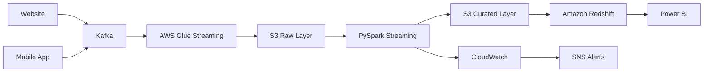

# Case Study 02: Real-Time Clickstream Analytics Platform

## Overview

This case study demonstrates how to design a scalable, fault-tolerant, and near real-time clickstream analytics platform capable of processing millions of website events every day.

The platform collects user interactions from web and mobile applications, processes streaming events, stores curated data in a Data Lake and Data Warehouse, and enables business teams to analyze customer behavior through dashboards.

---

# Business Scenario

A large e-commerce company wants to understand customer behavior across its digital platforms.

Every click generated by customers should be collected and analyzed to answer questions such as:

- Which pages are most visited?
- Where do users abandon checkout?
- Which products receive the highest engagement?
- What is the average session duration?
- Which marketing campaigns generate the highest conversions?
- Which devices are most commonly used?

The organization needs near real-time dashboards to support Product, Marketing, and Business teams.

---

# Business Goals

The platform should:

- Capture every user interaction.
- Process events with minimal latency.
- Store historical clickstream data.
- Enable behavioral analytics.
- Support millions of daily events.
- Scale automatically.
- Optimize cloud costs.

---

# Event Types

Typical events include:

- Page View
- Product View
- Search
- Add to Cart
- Remove from Cart
- Checkout Started
- Payment Completed
- Login
- Logout
- Session End

---

# Functional Requirements

The system should:

- Capture events from web and mobile applications.
- Validate incoming events.
- Remove duplicate records.
- Process streaming events.
- Store raw and curated datasets.
- Support analytical reporting.
- Generate KPIs for dashboards.

---

# Non-Functional Requirements

The platform should provide:

- High Availability
- Low Latency
- Scalability
- Fault Tolerance
- Security
- Monitoring
- Cost Optimization

---

# Scale Estimation

Assumptions:

- 20 million users
- 120 million events/day
- Peak throughput: 15,000 events/second
- Average event size: 1 KB
- Daily data volume: ~120 GB

---

# High-Level Architecture

---

# Why These AWS Services?

| Service | Purpose |
|----------|---------|
| Kafka | Event Streaming |
| AWS Glue Streaming | Stream Processing |
| Amazon S3 | Data Lake |
| PySpark | Transformations |
| Redshift | Analytics Warehouse |
| Power BI | Dashboards |
| CloudWatch | Monitoring |
| SNS | Alerts |

---

# Data Flow

1. User interacts with the website or mobile application.
2. Events are published to Kafka.
3. AWS Glue Streaming consumes Kafka topics.
4. Raw events are stored in Amazon S3.
5. PySpark validates and enriches events.
6. Curated data is written to S3.
7. Amazon Redshift loads curated datasets.
8. Power BI dashboards refresh every few minutes.
9. CloudWatch monitors the pipeline and SNS sends alerts for failures.

---

# Data Validation

The pipeline validates:

- Mandatory fields
- Event timestamp
- User ID
- Session ID
- Event type
- Duplicate events
- Invalid JSON payloads

Invalid events are stored in a quarantine location for later analysis.

---

# Security

Security controls include:

- IAM Roles
- Least Privilege Access
- Encryption at Rest (S3, Redshift)
- TLS for data in transit
- AWS KMS
- Secrets Manager
- CloudTrail Audit Logs

---

# Monitoring

The platform tracks:

- Events received per second
- Processing latency
- Failed events
- Pipeline status
- Consumer lag
- Job duration
- Data freshness
- Dashboard refresh status

CloudWatch dashboards visualize operational health, and SNS alerts notify the support team of failures.

---

# Cost Optimization

Best practices include:

- Store data in Parquet format.
- Compress files using Snappy.
- Partition data by Event Date and Event Type.
- Process only incremental data.
- Use serverless Glue Streaming where appropriate.
- Archive historical data with S3 Lifecycle Policies.

---

# Scalability

The architecture supports growth through:

- Kafka partitioning
- Parallel Spark processing
- Auto-scaling Glue jobs
- Elastic S3 storage
- Scalable Redshift compute

---

# Failure Handling

If a failure occurs:

- Retry processing automatically.
- Store failed events in a Dead Letter Queue (DLQ) or quarantine bucket.
- Send alerts through SNS.
- Resume processing from the last committed Kafka offset.
- Prevent duplicate processing using idempotent logic.

---

# Trade-offs

| Decision | Benefit | Trade-off |
|----------|----------|-----------|
| Kafka | High-throughput streaming | Requires topic management |
| Glue Streaming | Serverless processing | Less control than custom Spark clusters |
| S3 Data Lake | Low-cost storage | Requires governance |
| Redshift | Fast analytical queries | Higher cost than Athena for ad hoc queries |

---

# Possible Enhancements

- Add Apache Flink for complex event processing.
- Implement Delta Lake or Apache Iceberg.
- Integrate dbt for transformation management.
- Introduce ML models for customer segmentation.
- Build recommendation systems using clickstream data.

---

# Common Interview Questions

### Why Kafka for clickstream data?

Kafka provides high-throughput, fault-tolerant, and scalable event streaming, making it ideal for capturing millions of user interactions.

---

### Why store raw data in S3?

S3 offers durable, scalable, and low-cost storage, enabling future reprocessing and historical analysis.

---

### How would you handle duplicate events?

Use unique event identifiers, deduplicate during transformation, and ensure idempotent writes to downstream systems.

---

### How do you monitor streaming pipelines?

Track consumer lag, processing latency, throughput, failed events, and job health using CloudWatch dashboards and alerts.

---

### How do you reduce streaming costs?

Compress data, partition efficiently, archive historical data, optimize Spark jobs, and scale compute resources dynamically.

---

# Key Takeaways

- Design streaming systems for scalability and fault tolerance.
- Preserve raw data for replay and auditing.
- Validate events before transformation.
- Monitor latency and consumer lag continuously.
- Optimize storage and compute costs through efficient formats and partitioning.
