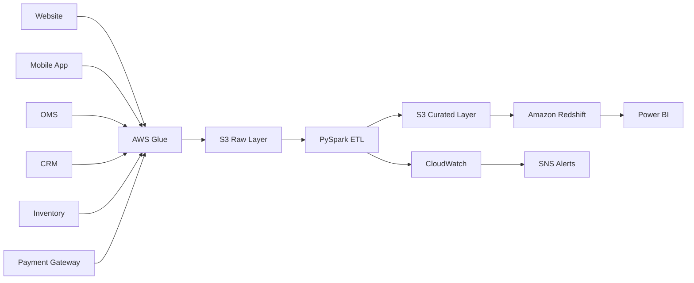

# Case Study 03: E-commerce Analytics Platform

## Overview

This case study demonstrates the design of a modern cloud-native analytics platform for a large e-commerce company. The platform ingests transactional and customer data from multiple business systems, processes it using scalable ETL pipelines, and delivers analytics-ready datasets for business intelligence and decision-making.

The architecture focuses on scalability, reliability, security, monitoring, and cost optimization while supporting both batch and near real-time workloads.

---

# Business Scenario

An e-commerce company sells products across multiple categories through its website and mobile application.

Business teams require a centralized analytics platform to answer questions such as:

- What are today's sales?
- Which products are top-selling?
- Which customers purchase most frequently?
- What is the average order value?
- Which marketing campaigns drive conversions?
- Which products are frequently returned?
- How much inventory is available?
- Which cities generate the highest revenue?

The company processes millions of transactions every day and requires reliable reporting for executives, finance, marketing, supply chain, and customer support.

---

# Business Goals

The platform should:

- Centralize business data from multiple systems.
- Provide trusted analytics datasets.
- Support hourly and daily reporting.
- Maintain historical customer and product information.
- Scale as order volume increases.
- Deliver dashboards with minimal delay.
- Reduce operational and cloud costs.

---

# Source Systems

The platform ingests data from:

- Website
- Mobile Application
- Order Management System
- Payment Gateway
- Inventory System
- CRM
- Marketing Platform
- Shipping Partner
- Customer Support System

---

# Functional Requirements

The platform should:

- Ingest data from multiple sources.
- Support batch and incremental loads.
- Process new orders every hour.
- Detect duplicate transactions.
- Maintain customer and product history.
- Generate analytical datasets.
- Support Power BI dashboards.
- Enable historical trend analysis.

---

# Non-Functional Requirements

The platform should provide:

- High Availability
- Scalability
- Fault Tolerance
- Security
- Data Quality
- Monitoring
- Cost Optimization
- Disaster Recovery

---

# Scale Estimation

Assumptions:

- 8 million registered customers
- 2 million orders/day
- 250 GB of new data/day
- 30 TB historical data
- Dashboard refresh every hour

---

# High-Level Architecture

---

# Data Flow

1. Business systems generate transactional and master data.
2. AWS Glue extracts source data.
3. Raw data is stored in Amazon S3.
4. PySpark performs validation, cleansing, enrichment, and transformation.
5. Curated datasets are written back to Amazon S3.
6. Amazon Redshift loads curated tables.
7. Power BI dashboards provide business insights.
8. CloudWatch monitors the pipeline and SNS notifies support teams of failures.

---

# Data Model

### Fact Tables

- Fact Orders
- Fact Payments
- Fact Returns
- Fact Shipments

### Dimension Tables

- Dim Customer
- Dim Product
- Dim Store
- Dim Date
- Dim Geography
- Dim Promotion

The warehouse follows a **Star Schema** for analytical performance.

---

# Slowly Changing Dimensions

Customer and Product dimensions use **SCD Type 2** to preserve historical changes.

Example:

Customer changes city from Delhi to Noida.

Instead of updating the existing record, a new version is inserted while retaining the old history.

---

# Data Quality

The platform validates:

- Null values
- Duplicate records
- Invalid order amounts
- Missing customer IDs
- Invalid product IDs
- Schema changes
- Record counts

Failed records are moved to a quarantine area for investigation.

---

# Security

Security controls include:

- IAM Roles
- Least Privilege Access
- Encryption at Rest (S3 and Redshift)
- TLS for data in transit
- AWS KMS
- Secrets Manager
- CloudTrail Audit Logs

---

# Monitoring

Operational monitoring includes:

- Pipeline success rate
- Job duration
- SLA compliance
- Failed jobs
- Record counts
- Data freshness
- Dashboard refresh status

CloudWatch dashboards provide visibility into pipeline health, and SNS sends alerts for failures.

---

# Cost Optimization

Best practices:

- Store datasets in Parquet format.
- Compress files using Snappy.
- Partition data by Order Date.
- Enable Glue Job Bookmarks.
- Archive historical data using S3 Lifecycle Policies.
- Optimize Redshift sort keys and distribution keys.

---

# Scalability

The platform scales through:

- Parallel Glue jobs
- Partitioned S3 storage
- Elastic Redshift compute
- Auto-scaling ETL resources
- Decoupled storage and compute

---

# Failure Handling

If an ETL job fails:

- Retry automatically.
- Preserve checkpoints.
- Log execution details.
- Notify support teams using SNS.
- Prevent partial loads.
- Resume processing from the last successful checkpoint.

---

# Trade-offs

| Decision | Benefit | Trade-off |
|----------|----------|-----------|
| S3 Data Lake | Durable and low-cost storage | Requires governance |
| Glue | Serverless ETL | Less customizable than EMR |
| Redshift | Fast analytical queries | Higher cost than Athena for infrequent reporting |
| Hourly Batch | Lower cost | Slight reporting latency |

---

# Possible Enhancements

- Introduce Kafka for real-time order events.
- Implement CDC using AWS DMS.
- Add Delta Lake or Apache Iceberg.
- Use dbt for transformation management.
- Build recommendation models using clickstream data.
- Add anomaly detection for fraud prevention.

---

# Common Interview Questions

### Why use a Star Schema?

A Star Schema simplifies analytical queries, improves query performance, and is easier for BI tools to consume.

---

### Why implement SCD Type 2?

SCD Type 2 preserves historical changes, enabling accurate trend analysis and historical reporting.

---

### Why partition S3 data?

Partitioning reduces the amount of data scanned, improving query performance and lowering costs.

---

### How do you handle late-arriving data?

Use event timestamps, watermarking where appropriate, and update fact tables during scheduled incremental loads.

---

### How would you optimize Redshift?

Choose appropriate distribution styles, define sort keys, vacuum tables, analyze statistics, and avoid unnecessary data movement.

---

### How do you monitor ETL pipelines?

Track execution time, failures, retries, record counts, SLA compliance, and data freshness using CloudWatch and SNS.

---

# Key Takeaways

- Separate raw and curated layers in the data lake.
- Use a Star Schema for analytical workloads.
- Preserve history using SCD Type 2.
- Validate data before loading into the warehouse.
- Secure sensitive business data with IAM, encryption, and audit logging.
- Continuously monitor pipeline health and optimize cloud costs.
