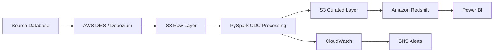

# Case Study 04: Change Data Capture (CDC) Pipeline

## Overview

This case study demonstrates how to design a Change Data Capture (CDC) pipeline that captures only incremental changes from source databases instead of reloading the entire dataset. CDC improves efficiency by reducing processing time, storage usage, and cloud costs while keeping downstream systems synchronized with source data.

---

# Business Scenario

A retail bank maintains customer, account, loan, and transaction data in an operational database.

Every day:

- New customers are created.
- Existing customer information is updated.
- Accounts are closed.
- Loan records change.
- Transactions are continuously generated.

Business teams require analytics that reflects the latest changes without reprocessing the entire database.

The organization needs an incremental data pipeline that captures Inserts, Updates, and Deletes with minimal impact on the source systems.

---

# Business Goals

The platform should:

- Capture only changed records.
- Reduce ETL execution time.
- Minimize source database load.
- Keep analytical data up to date.
- Maintain historical changes where required.
- Scale as transaction volumes increase.

---

# Functional Requirements

The platform should:

- Detect Inserts, Updates, and Deletes.
- Process incremental changes.
- Preserve data consistency.
- Support retry mechanisms.
- Prevent duplicate processing.
- Load changes into the Data Warehouse.

---

# Non-Functional Requirements

The platform should provide:

- High Availability
- Scalability
- Fault Tolerance
- Security
- Monitoring
- Low Latency
- Cost Optimization

---

# Scale Estimation

Assumptions:

- Source database size: 5 TB
- Daily new records: 8 million
- Daily updates: 3 million
- Daily deletes: 500,000
- Hourly incremental loads

---

# Why CDC?

Without CDC:

- Entire tables are reloaded.
- ETL jobs run longer.
- Cloud costs increase.
- Source systems experience unnecessary load.

With CDC:

- Only changed records are processed.
- Faster pipelines.
- Lower infrastructure costs.
- Near real-time reporting.

---

# High-Level Architecture

---

# Data Flow

1. Source database generates Insert, Update, and Delete events.
2. AWS DMS or Debezium captures changes from transaction logs.
3. Changes are stored in the Raw layer on Amazon S3.
4. PySpark processes CDC events.
5. Incremental datasets are written to the Curated layer.
6. Redshift merges new data into analytical tables.
7. Power BI dashboards refresh using the latest data.

---

# CDC Operations

## Insert

New record arrives.

Insert into destination table.

---

## Update

Existing record changes.

Update destination record.

If historical tracking is required, implement SCD Type 2.

---

## Delete

Record deleted in source.

Soft delete or hard delete depending on business requirements.

---

# MERGE Strategy

Instead of truncating and reloading tables, use MERGE operations:

- Match existing records.
- Insert new records.
- Update changed records.
- Delete obsolete records where applicable.

---

# Data Quality

Validate:

- Duplicate keys
- Missing primary keys
- Invalid timestamps
- Null mandatory fields
- Record counts
- Schema consistency

Invalid records are written to a quarantine location.

---

# Security

Security controls include:

- IAM Roles
- Least Privilege Access
- Encryption using AWS KMS
- TLS for data in transit
- Secrets Manager for credentials
- CloudTrail for auditing

---

# Monitoring

Track:

- CDC latency
- Number of Inserts
- Number of Updates
- Number of Deletes
- Pipeline failures
- Retry attempts
- Data freshness

CloudWatch dashboards provide operational visibility, and SNS sends alerts for failures.

---

# Failure Handling

If the pipeline fails:

- Retry processing.
- Resume from the last processed checkpoint.
- Avoid duplicate writes.
- Preserve transaction ordering.
- Notify support teams.

---

# Cost Optimization

Best practices:

- Process only incremental changes.
- Store data in Parquet format.
- Compress files using Snappy.
- Partition by business date.
- Archive historical data using S3 Lifecycle Policies.

---

# Scalability

The platform scales through:

- Parallel Spark processing.
- Partitioned S3 storage.
- Auto-scaling ETL jobs.
- Elastic Data Warehouse compute.

---

# Trade-offs

| Decision | Benefit | Trade-off |
|----------|----------|-----------|
| CDC | Faster incremental loads | Additional implementation complexity |
| AWS DMS | Managed replication | Less flexible than custom solutions |
| Debezium | Open-source and flexible | Requires Kafka infrastructure |
| MERGE | Efficient updates | More complex SQL logic |

---

# Possible Enhancements

- Introduce Kafka for event streaming.
- Use Apache Iceberg or Delta Lake for ACID tables.
- Automate schema evolution.
- Add Great Expectations for data quality.
- Implement data lineage.

---

# Common Interview Questions

### What is CDC?

Change Data Capture (CDC) is a technique for capturing only Inserts, Updates, and Deletes from a source system instead of processing the entire dataset.

---

### Why use CDC instead of Full Load?

CDC reduces processing time, lowers infrastructure costs, minimizes source database impact, and enables more frequent data refreshes.

---

### What tools can implement CDC?

- AWS DMS
- Debezium
- Oracle GoldenGate
- SQL Server CDC
- PostgreSQL Logical Replication

---

### How do you prevent duplicate processing?

Use checkpoints, unique business keys, idempotent writes, and transactional MERGE operations.

---

### What if a record is deleted?

Depending on business requirements, implement soft deletes, hard deletes, or maintain historical records using SCD Type 2.

---

# Key Takeaways

- CDC captures only changed records.
- Incremental processing improves performance and reduces costs.
- MERGE operations simplify updates and inserts.
- Monitoring and checkpointing are essential for reliable CDC pipelines.
- Choose managed or open-source CDC tools based on operational needs.
