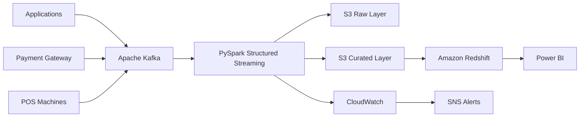

# Case Study 05: Real-Time Streaming Data Platform

## Overview

This case study demonstrates how to design a scalable, fault-tolerant, and low-latency streaming data platform capable of processing millions of events in real time. The platform captures continuous event streams, processes them using distributed stream processing, stores data in a Data Lake, and serves analytics dashboards with near real-time insights.

---

## Architecture Diagram

---

# Business Scenario

A digital payments company wants to monitor payment transactions as they happen.

Business teams require:

- Live transaction dashboards
- Real-time fraud monitoring
- Payment success rate
- Transaction failure analysis
- Merchant performance
- Customer activity monitoring

Instead of waiting for hourly batch jobs, analytics should be available within seconds.

---

# Business Goals

The platform should:

- Process events continuously.
- Support millions of events per day.
- Handle traffic spikes without downtime.
- Detect failures quickly.
- Store historical events for analytics.
- Deliver low-latency dashboards.

---

# Source Systems

- Mobile Application
- Web Portal
- Payment Gateway
- POS Machines
- Third-Party APIs

---

# Functional Requirements

The platform should:

- Ingest streaming events.
- Process events in near real time.
- Validate and enrich incoming data.
- Detect duplicate events.
- Store raw and curated datasets.
- Load analytical tables.
- Refresh dashboards continuously.

---

# Non-Functional Requirements

- High Availability
- Low Latency
- Scalability
- Fault Tolerance
- Data Durability
- Security
- Monitoring
- Cost Optimization

---

# Scale Estimation

Assumptions:

- 50 million transactions/day
- Peak throughput: 25,000 events/second
- Average event size: 2 KB
- Daily data volume: ~100 GB

---

# High-Level Architecture

---

# Why These Technologies?

| Technology | Purpose |
|------------|---------|
| Kafka | Distributed Event Streaming |
| PySpark Structured Streaming | Stream Processing |
| Amazon S3 | Data Lake |
| Redshift | Analytics |
| Power BI | Dashboards |
| CloudWatch | Monitoring |
| SNS | Alerting |

---

# Data Flow

1. Applications generate streaming events.
2. Events are published to Kafka topics.
3. PySpark Structured Streaming consumes Kafka messages.
4. Raw events are stored in Amazon S3.
5. Events are validated and enriched.
6. Curated datasets are written to Amazon S3.
7. Amazon Redshift loads analytical tables.
8. Dashboards refresh every few minutes.

---

# Streaming Concepts

### Event Time

The time when an event actually occurred.

---

### Processing Time

The time when the event is processed.

---

### Watermarking

Used to handle late-arriving events while preventing unbounded state growth.

---

### Checkpointing

Stores processing progress so jobs can recover after failures.

---

### Exactly-Once Processing

Ensures events are processed only once, preventing duplicates in downstream systems.

---

# Data Quality

Validate:

- Mandatory fields
- Duplicate Event IDs
- Invalid timestamps
- Missing customer IDs
- Schema consistency

Invalid records are sent to a quarantine area.

---

# Security

Security measures include:

- IAM Roles
- TLS encryption
- AWS KMS
- Secrets Manager
- CloudTrail
- Least Privilege Access

---

# Monitoring

Track:

- Streaming latency
- Kafka consumer lag
- Throughput
- Failed records
- Processing duration
- Checkpoint health
- Data freshness

CloudWatch dashboards visualize operational health, and SNS sends alerts for failures.

---

# Failure Handling

If failures occur:

- Resume from checkpoints.
- Retry failed processing.
- Prevent duplicate writes.
- Send operational alerts.
- Preserve event ordering where required.

---

# Cost Optimization

Best practices:

- Store data in Parquet.
- Compress with Snappy.
- Partition by event date.
- Scale streaming jobs dynamically.
- Archive historical data using S3 Lifecycle Policies.

---

# Scalability

The architecture scales through:

- Kafka partitioning.
- Parallel Spark executors.
- Elastic S3 storage.
- Auto-scaling compute resources.

---

# Trade-offs

| Decision | Benefit | Trade-off |
|----------|----------|-----------|
| Kafka | High throughput | Operational complexity |
| Spark Structured Streaming | Unified batch + streaming APIs | Higher resource usage |
| S3 | Low-cost storage | Requires governance |
| Redshift | Fast analytics | Higher cost than Athena for infrequent queries |

---

# Possible Enhancements

- Add Apache Flink for advanced event processing.
- Introduce Delta Lake or Apache Iceberg.
- Integrate ML-based fraud detection.
- Add real-time anomaly detection.
- Implement schema registry for event validation.

---

# Common Interview Questions

### Why Kafka instead of RabbitMQ?

Kafka is designed for high-throughput event streaming, supports durable log storage, replayability, partitioning, and horizontal scalability.

---

### What is consumer lag?

Consumer lag is the difference between the latest Kafka offset and the last offset processed by a consumer.

---

### What is watermarking?

Watermarking defines how long the system waits for late-arriving events before finalizing aggregations.

---

### Why checkpointing?

Checkpointing stores processing progress, enabling recovery after failures without reprocessing all events.

---

### How do you achieve exactly-once processing?

Use checkpointing, idempotent writes, transactional sinks where supported, and deduplication based on unique event identifiers.

---

# Key Takeaways

- Kafka provides reliable, scalable event streaming.
- Structured Streaming enables near real-time analytics.
- Checkpointing and watermarking improve reliability.
- Monitoring consumer lag and latency is critical.
- Cost optimization depends on efficient storage, partitioning, and scalable compute.
