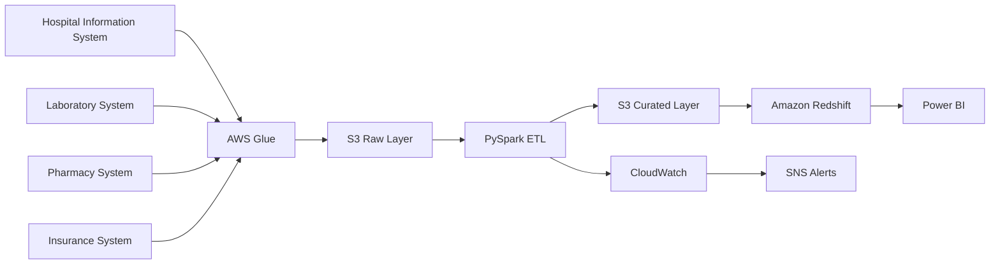
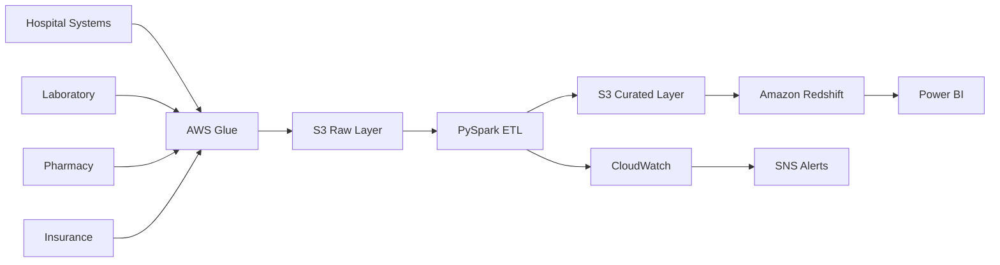

# Case Study 06: Healthcare Analytics Platform

## Overview

This case study demonstrates how to design a secure, scalable, and compliant healthcare analytics platform. The platform ingests patient, appointment, laboratory, pharmacy, and insurance data from multiple hospital systems and transforms it into analytics-ready datasets while protecting sensitive healthcare information.

The architecture emphasizes security, compliance, reliability, monitoring, and cost optimization.

---

## Architecture Diagram

---

# Business Scenario

A healthcare organization operates multiple hospitals and clinics.

Data is generated from:

- Hospital Information System (HIS)
- Electronic Health Records (EHR)
- Laboratory Information System (LIS)
- Pharmacy System
- Appointment Management
- Insurance Claims
- Billing System

The organization wants to build a centralized analytics platform to support operational reporting, patient care analytics, financial reporting, and executive dashboards.

---

# Business Goals

The platform should:

- Consolidate healthcare data from multiple systems.
- Maintain patient privacy.
- Support analytical reporting.
- Improve operational efficiency.
- Scale as patient volume grows.
- Meet regulatory and compliance requirements.

---

# Functional Requirements

The platform should:

- Ingest data from multiple source systems.
- Process batch and incremental loads.
- Validate healthcare records.
- Maintain historical patient information.
- Generate analytics-ready datasets.
- Support BI dashboards.

---

# Non-Functional Requirements

The platform should provide:

- High Availability
- Scalability
- Fault Tolerance
- Security
- Compliance
- Monitoring
- Disaster Recovery
- Cost Optimization

---

# Scale Estimation

Assumptions:

- 6 million patients
- 120 hospitals
- 50 million medical records
- 250 GB new data/day
- Hourly incremental refresh

---

# High-Level Architecture

---

# Data Flow

1. Healthcare systems generate operational data.
2. AWS Glue extracts source data.
3. Raw data is stored in Amazon S3.
4. PySpark validates, standardizes, and enriches records.
5. Curated datasets are written to Amazon S3.
6. Amazon Redshift loads analytical tables.
7. Power BI dashboards provide operational and clinical insights.

---

# Data Model

### Fact Tables

- Fact Patient Visits
- Fact Lab Results
- Fact Prescriptions
- Fact Claims

### Dimension Tables

- Dim Patient
- Dim Doctor
- Dim Hospital
- Dim Date
- Dim Department

---

# Data Quality

Validate:

- Missing Patient IDs
- Invalid Dates
- Duplicate Medical Records
- Invalid Diagnosis Codes
- Missing Insurance Details
- Schema Changes

Invalid records are moved to a quarantine area for review.

---

# Security

Healthcare data is highly sensitive.

The platform implements:

- IAM Roles
- Least Privilege Access
- Encryption at Rest
- TLS Encryption
- AWS KMS
- Secrets Manager
- CloudTrail Audit Logs
- Role-Based Access Control (RBAC)

Sensitive fields such as patient identifiers should be masked or tokenized before being exposed to reporting users.

---

# Compliance

The platform should support healthcare compliance requirements by:

- Encrypting sensitive data.
- Auditing all access.
- Restricting user permissions.
- Retaining historical records according to policy.
- Supporting secure backup and disaster recovery processes.

---

# Monitoring

Track:

- Pipeline failures
- Job duration
- Record counts
- Data freshness
- Failed validations
- SLA compliance

CloudWatch dashboards provide visibility, while SNS alerts notify the operations team of failures.

---

# Failure Handling

If failures occur:

- Retry ETL jobs.
- Resume from checkpoints.
- Preserve audit logs.
- Prevent partial data loads.
- Notify support teams.

---

# Cost Optimization

Best practices:

- Store data in Parquet format.
- Compress files using Snappy.
- Partition by Visit Date.
- Archive historical data using S3 Lifecycle Policies.
- Process incremental changes only.

---

# Scalability

The platform scales through:

- Parallel ETL processing.
- Partitioned Data Lake storage.
- Auto-scaling Glue jobs.
- Elastic Redshift compute.

---

# Trade-offs

| Decision | Benefit | Trade-off |
|----------|----------|-----------|
| S3 Data Lake | Low-cost storage | Requires governance |
| Glue | Serverless ETL | Less customization than EMR |
| Redshift | Fast analytics | Higher cost for infrequent workloads |
| Incremental Loads | Lower processing cost | Additional implementation complexity |

---

# Possible Enhancements

- Add CDC for patient updates.
- Introduce real-time monitoring of critical events.
- Implement Apache Iceberg or Delta Lake.
- Add automated data quality frameworks.
- Build predictive healthcare analytics.

---

# Common Interview Questions

### Why is security critical in healthcare analytics?

Healthcare data contains sensitive personal information. Strong encryption, access controls, and auditing are required to protect patient privacy and meet regulatory requirements.

---

### How do you protect patient data?

Encrypt data at rest and in transit, implement IAM roles, use RBAC, store secrets securely, and mask sensitive fields in analytical datasets.

---

### Why process incremental data?

Incremental processing reduces execution time, minimizes cloud costs, and avoids unnecessary reprocessing.

---

### How do you ensure data quality?

Validate mandatory fields, remove duplicates, check schema consistency, and quarantine invalid records.

---

### How do you monitor healthcare ETL pipelines?

Track execution time, failures, data freshness, validation failures, and SLA compliance using CloudWatch dashboards and alerts.

---

# Key Takeaways

- Healthcare platforms require strong security and governance.
- Sensitive data should be encrypted and access-controlled.
- Incremental ETL improves efficiency.
- Monitoring and auditing are essential.
- Data quality directly impacts business and clinical reporting.
