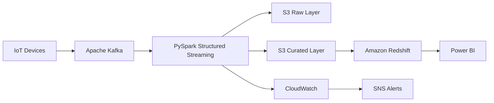

# Case Study 07: IoT Analytics Platform

## Overview

This case study demonstrates how to design a scalable IoT analytics platform capable of processing millions of sensor events from connected devices. The platform collects telemetry data, processes streaming and batch workloads, stores historical data, and enables operational dashboards for monitoring and analytics.

The architecture emphasizes scalability, reliability, monitoring, security, and cost optimization.

---

# Business Scenario

A manufacturing company operates thousands of IoT-enabled machines across multiple production plants.

Each machine continuously sends telemetry data such as:

- Temperature
- Pressure
- Humidity
- Voltage
- Machine Status
- Vibration
- Power Consumption

The business wants a centralized analytics platform to monitor machine health, analyze trends, detect abnormal behavior, and improve operational efficiency.

---

# Business Goals

The platform should:

- Collect sensor data continuously.
- Process millions of events daily.
- Support near real-time monitoring.
- Store historical telemetry data.
- Enable operational dashboards.
- Scale automatically as new devices are added.

---

# Functional Requirements

The platform should:

- Ingest sensor events.
- Validate incoming data.
- Process streaming events.
- Support historical analytics.
- Generate business KPIs.
- Refresh dashboards regularly.

---

# Non-Functional Requirements

The platform should provide:

- High Availability
- Scalability
- Fault Tolerance
- Low Latency
- Security
- Monitoring
- Cost Optimization

---

# Scale Estimation

Assumptions:

- 100,000 IoT devices
- 1 event every 5 seconds
- Peak throughput: 20,000 events/second
- Daily data volume: ~1 TB

---

# High-Level Architecture

---

# Data Flow

1. IoT devices generate telemetry events.
2. Kafka receives streaming events.
3. PySpark Structured Streaming consumes Kafka topics.
4. Raw events are stored in Amazon S3.
5. Streaming jobs validate and enrich records.
6. Curated datasets are written to Amazon S3.
7. Amazon Redshift loads analytical tables.
8. Dashboards visualize machine health and operational KPIs.

---

# Data Model

### Fact Tables

- Fact Sensor Readings
- Fact Machine Events
- Fact Alerts

### Dimension Tables

- Dim Device
- Dim Factory
- Dim Machine
- Dim Date

---

# Data Quality

Validate:

- Device ID
- Event Timestamp
- Sensor Values
- Duplicate Events
- Invalid Readings
- Missing Records

Failed events are written to a quarantine location.

---

# Security

The platform implements:

- IAM Roles
- Encryption at Rest
- TLS Encryption
- AWS KMS
- Secrets Manager
- Least Privilege Access

---

# Monitoring

Monitor:

- Incoming Events
- Streaming Latency
- Consumer Lag
- Failed Events
- Processing Time
- Data Freshness
- Dashboard Availability

CloudWatch dashboards monitor pipeline health, and SNS sends alerts for failures.

---

# Failure Handling

If processing fails:

- Retry automatically.
- Resume from checkpoints.
- Preserve event ordering where required.
- Log failures.
- Notify support teams.

---

# Cost Optimization

Best practices:

- Store telemetry in Parquet format.
- Compress files with Snappy.
- Partition by Event Date.
- Archive older data with S3 Lifecycle Policies.
- Scale streaming jobs dynamically.

---

# Scalability

The platform scales through:

- Kafka partitioning.
- Parallel Spark executors.
- Elastic S3 storage.
- Auto-scaling compute resources.

---

# Trade-offs

| Decision | Benefit | Trade-off |
|----------|----------|-----------|
| Kafka | High-throughput streaming | Operational complexity |
| Spark Streaming | Unified processing engine | Resource intensive |
| S3 | Low-cost storage | Requires governance |
| Redshift | Fast analytics | Additional warehouse cost |

---

# Possible Enhancements

- Add predictive maintenance using Machine Learning.
- Implement anomaly detection.
- Use Delta Lake or Apache Iceberg.
- Integrate Grafana for operational monitoring.
- Build real-time alerting based on sensor thresholds.

---

# Common Interview Questions

### Why Kafka for IoT data?

Kafka handles high-throughput event streaming, supports replayability, and scales horizontally.

---

### Why use Parquet?

Parquet provides efficient columnar storage, reduces storage costs, and improves analytical query performance.

---

### How do you process late-arriving events?

Use event timestamps, watermarking, and checkpointing to ensure consistent processing.

---

### How do you scale an IoT platform?

Increase Kafka partitions, scale Spark executors, partition storage efficiently, and use elastic cloud services.

---

### How do you monitor streaming pipelines?

Track latency, throughput, consumer lag, failed records, and processing time using CloudWatch dashboards and alerts.

---

# Key Takeaways

- IoT platforms require highly scalable streaming architectures.
- Efficient storage formats reduce both cost and query time.
- Monitoring latency and consumer lag is critical.
- Checkpointing improves reliability.
- Historical telemetry data enables long-term operational analysis.
