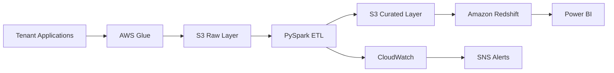

# Case Study 08: Multi-Tenant Analytics Platform

## Overview

This case study demonstrates how to design a scalable, secure, and cost-efficient multi-tenant analytics platform for a Software-as-a-Service (SaaS) company. The platform serves multiple customers (tenants) using shared cloud infrastructure while ensuring logical data isolation, security, and reliable analytics.

The architecture focuses on scalability, tenant isolation, security, monitoring, and cost optimization.

---

# Business Scenario

A SaaS company provides CRM software to thousands of businesses.

Each customer (tenant) generates data such as:

- Customer Information
- Sales Opportunities
- Leads
- Orders
- Support Tickets
- User Activity
- Billing Information

Each tenant expects:

- Secure data isolation
- Individual dashboards
- Fast query performance
- Reliable reporting

The company wants to avoid maintaining separate infrastructure for every customer while ensuring that one tenant cannot access another tenant's data.

---

# Business Goals

The platform should:

- Support thousands of tenants.
- Provide secure tenant isolation.
- Scale automatically.
- Deliver near real-time analytics.
- Optimize infrastructure costs.
- Support onboarding of new tenants with minimal effort.

---

# Functional Requirements

The platform should:

- Ingest tenant-specific data.
- Process batch and incremental loads.
- Maintain tenant isolation.
- Generate analytics-ready datasets.
- Support Power BI dashboards.
- Provide tenant-level reporting.

---

# Non-Functional Requirements

The platform should provide:

- High Availability
- Scalability
- Security
- Fault Tolerance
- Monitoring
- Cost Optimization
- Disaster Recovery

---

# Scale Estimation

Assumptions:

- 5,000 tenants
- 100 GB new data/day
- 50 million records/day
- Dashboard refresh every hour

---

# High-Level Architecture

---

# Data Flow

1. Tenant applications generate business data.
2. AWS Glue extracts source data.
3. Raw datasets are stored in Amazon S3.
4. PySpark validates, transforms, and enriches tenant data.
5. Curated datasets are written to Amazon S3.
6. Amazon Redshift loads analytical tables.
7. Power BI dashboards display tenant-specific reports.

---

# Tenant Isolation Strategies

### Shared Database, Shared Schema

- Lowest cost
- Simplest architecture
- Weakest isolation

---

### Shared Database, Separate Schema

- Better logical separation
- Easier tenant management
- Moderate operational complexity

---

### Separate Database Per Tenant

- Strong isolation
- Higher infrastructure cost
- Easier compliance for regulated customers

The appropriate strategy depends on business, security, and compliance requirements.

---

# Data Model

### Fact Tables

- Fact Orders
- Fact Sales
- Fact Support Tickets

### Dimension Tables

- Dim Tenant
- Dim Customer
- Dim Product
- Dim Date

Each record includes a `Tenant_ID` to support tenant-level filtering.

---

# Data Quality

Validate:

- Tenant_ID presence
- Duplicate records
- Missing primary keys
- Invalid dates
- Schema consistency
- Record counts

Invalid records are moved to a quarantine area.

---

# Security

The platform implements:

- IAM Roles
- Least Privilege Access
- Encryption at Rest
- TLS Encryption
- AWS KMS
- Secrets Manager
- CloudTrail Audit Logs

Analytical queries should enforce tenant-level filtering (for example, using Row-Level Security where supported).

---

# Monitoring

Track:

- Pipeline failures
- Job duration
- Data freshness
- Tenant onboarding status
- Record counts
- Dashboard availability

CloudWatch dashboards monitor operational health, and SNS sends alerts for failures.

---

# Failure Handling

If failures occur:

- Retry ETL jobs.
- Resume from checkpoints.
- Prevent partial loads.
- Notify support teams.
- Preserve processing logs.

---

# Cost Optimization

Best practices:

- Store data in Parquet.
- Compress with Snappy.
- Partition by Business Date.
- Process incremental changes.
- Archive historical data using S3 Lifecycle Policies.
- Use shared infrastructure where appropriate.

---

# Scalability

The platform scales through:

- Parallel ETL jobs.
- Elastic Data Lake storage.
- Auto-scaling Glue jobs.
- Elastic Redshift compute.

---

# Trade-offs

| Decision | Benefit | Trade-off |
|----------|----------|-----------|
| Shared Infrastructure | Lower cost | Requires strong tenant isolation |
| Separate Databases | Strong isolation | Higher infrastructure cost |
| S3 Data Lake | Low-cost storage | Requires governance |
| Redshift | Fast analytics | Higher cost for smaller tenants |

---

# Possible Enhancements

- Add CDC for tenant updates.
- Support real-time streaming.
- Introduce Apache Iceberg or Delta Lake.
- Implement automated tenant onboarding.
- Add predictive analytics for customer usage.

---

# Common Interview Questions

### What is a Multi-Tenant Architecture?

A multi-tenant architecture allows multiple customers (tenants) to share the same application and infrastructure while keeping their data logically isolated.

---

### How do you isolate tenant data?

Use tenant identifiers, row-level security, schema separation, or separate databases depending on business requirements.

---

### When would you choose a separate database per tenant?

For highly regulated industries, premium customers, or when strict isolation and compliance are required.

---

### How do you scale a Multi-Tenant Analytics Platform?

Scale ETL jobs horizontally, partition storage efficiently, use elastic cloud services, and optimize warehouse workloads.

---

### How do you secure tenant data?

Implement IAM roles, encryption, RBAC, row-level security, audit logging, and least-privilege access.

---

# Key Takeaways

- Multi-tenant architectures balance scalability, security, and cost.
- Tenant isolation is a fundamental design consideration.
- Shared infrastructure reduces operational costs but requires robust access controls.
- Monitoring and data quality remain critical as tenant count grows.
- Design decisions should align with business, security, and compliance requirements.
